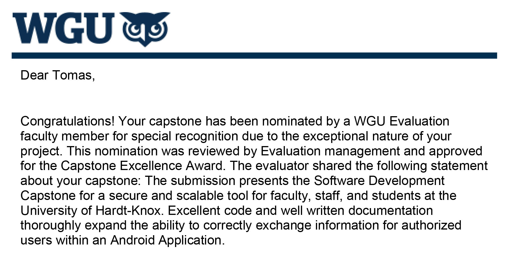

# Capstone - WebUI
This is the administrator frontend GUI for the WGU Capstone final student project. Uses AngularJS to communicate with 
the remote backend via a RESTful API. Provides monitoring, data visualization and editing of coursework and faculty.

### Awarded for Excellence

